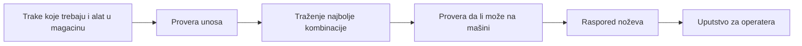
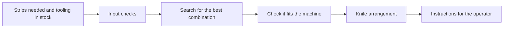

# Shop-floor tools: softver nastao iz proizvodnje / software built from hands-on production work

[](https://github.com/Sogli/shop-floor-tools/actions/workflows/portfolio-ci.yml)

---

# 🇷🇸 Srpski

Radim neposredno na mašinama za obradu i doradu bakra. Ponavljajuća podešavanja, ručne konverzije i praćenje proizvodnje trošili su vreme i ostavljali prostor za greške, pa sam napravio alate koje sam želeo da imam u pogonu.

Ovaj repozitorijum je rezultat: zbirka praktičnih Python i Android aplikacija koje svakodnevni rad čine bržim, doslednijim i lakšim za proveru. Ujedno je i najjasniji primer kako pristupam inženjerstvu: krenem od stvarnog problema, modelujem ograničenja, isporučim nešto upotrebljivo, pa to popravljam kroz povratne informacije i granične slučajeve.

Repozitorijum ne sadrži proizvodne zapise, podatke o zaposlenima, dokumenta firme, kredencijale ni ključeve za potpisivanje.

## Spisak programa

### Python

| Program | Čemu služi |
|---|---|
| `python/cutting-optimizer` | Široka traka se seče na više užih. Program smisli kako da se noževi na mašini rasporede, da bi se dobile tražene trake uz što manje otpada. |

### Android

| Program | Čemu služi |
|---|---|
| `android/metraza` | Kaže koliko metara materijala ima u kolutu. |
| `android/kilaza` | Kaže koliko kilograma je kolut i sabira težine po porudžbini. |
| `android/coil-diameter` | Kaže koliko će kolut biti širok spolja kada se namota. |
| `android/pallet-packing` | Raspoređuje kolutove po paletama, po broju komada. |
| `android/pallet-weight-packing` | Slaže kolutove na palete tako da svaka paleta ima željenu težinu. |
| `android/equipment-tracking` | Vodi evidenciju ko je šta zadužio i do kada treba da vrati. |

## Izdvojeni projekat: optimizator rezanja

Kada treba iseći široku traku na više užih, neko mora da odluči koji noževi idu na mašinu i kojim redom. Ranije se to radilo na papiru, probom i greškom. Ovaj program to odluči umesto čoveka.

Kako radi:

- Uneseš koje trake ti trebaju i koji alat imaš u magacinu.
- Program proveri da li je unos moguć i uskladi mere.
- Isproba ogroman broj kombinacija i izabere najbolju.
- Proveri da li se izabrani raspored zaista može složiti na mašini.
- Ako baš ta kombinacija ne može, ponudi rezervnu varijantu.
- Na kraju ispiše na srpskom, običnim rečima, šta operater treba da stavi na mašinu.

Traženje najbolje kombinacije je isprva trajalo oko 39 sekundi, a posle doterivanja oko 21 sekundu, uz isti rezultat.



Pokretanje:

```bash
python -m venv .venv
source .venv/bin/activate
pip install -r python/cutting-optimizer/requirements.txt
python python/cutting-optimizer/m39.py
```

Svaki Android folder je nezavisan Android Studio projekat sa sopstvenim Gradle wrapper-om:

```bash
cd android/metraza
./gradlew testDebugUnitTest
./gradlew assembleDebug
```

---

# 🇬🇧 English

I work hands-on with copper-processing and finishing machinery. Repetitive setup calculations, handwritten conversions and operational tracking created avoidable time loss and room for error, so I built the tools I wanted to have on the shop floor.

This repository is the result: a collection of practical Python and Android applications created to make daily production work faster, more consistent and easier to verify. It is also the clearest example of how I approach engineering: start from a real problem, model the constraints, ship something usable, then improve it from feedback and edge cases.

No production records, employee data, company documents, credentials or signing keys are included.

## Program list

### Python

| Program | What it does |
|---|---|
| `python/cutting-optimizer` | A wide strip gets cut into several narrower ones. The program works out how to arrange the knives on the machine so you get the strips you need with as little waste as possible. |

### Android

| Program | What it does |
|---|---|
| `android/metraza` | Tells you how many metres of material are in a coil. |
| `android/kilaza` | Tells you how many kilograms a coil weighs and adds up the weight per order. |
| `android/coil-diameter` | Tells you how wide a coil will be on the outside once it is wound. |
| `android/pallet-packing` | Spreads coils across pallets by piece count. |
| `android/pallet-weight-packing` | Stacks coils onto pallets so each pallet hits the weight you want. |
| `android/equipment-tracking` | Keeps track of who took which tool and when it is due back. |

## Featured project: cutting setup optimizer

When a wide strip has to be cut into several narrower ones, someone has to decide which knives go on the machine and in what order. That used to be done on paper, by trial and error. This program makes the decision instead.

How it works:

- You enter the strips you need and the tooling you have in stock.
- The program checks the input is possible and lines up the measurements.
- It tries a huge number of combinations and picks the best one.
- It checks the chosen arrangement can actually be assembled on the machine.
- If that exact combination will not work, it offers a fallback.
- Finally it prints, in plain Serbian, what the operator should put on the machine.

Finding the best combination first took about 39 seconds, and after some tuning about 21 seconds, with the same result.



Run it with:

```bash
python -m venv .venv
source .venv/bin/activate
pip install -r python/cutting-optimizer/requirements.txt
python python/cutting-optimizer/m39.py
```

Each Android folder is an independent Android Studio project with its own Gradle wrapper:

```bash
cd android/metraza
./gradlew testDebugUnitTest
./gradlew assembleDebug
```
